# Вариантивное задание 4.2
## Написание запросов на языке SQL

### Цель работы
Изучение основ языка SQL для выполнения запросов SELECT с использованием различных операторов: DISTINCT, ORDER BY, LIMIT, JOIN, WHERE.

### Исходные данные
База данных "library" с таблицами:
- Book (книги)
- BookInLib (экземпляры книг в библиотеке) 
- BookStatus (статусы книг)

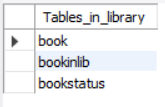
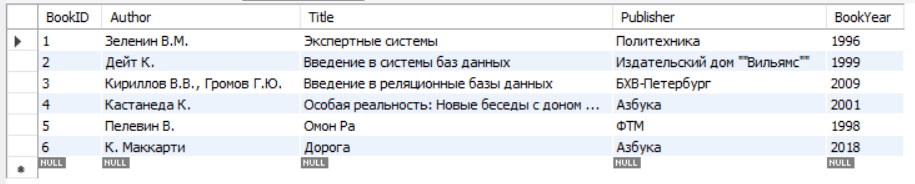

### Выполнение заданий

#### Задание 1-2: Добавление книг и вывод авторов с повторениями

Добавлены несколько книг одного автора для демонстрации работы оператора DISTINCT.

```sql
INSERT INTO Book (Author, Title, Publisher, BookYear) VALUES
('Мериме П.', 'Кармен', 'Азбука', 2015),
('Мериме П.', 'Коломба', 'Азбука', 2017),
('Мериме П.', 'Матео Фальконе', 'ФТМ', 2018);
```

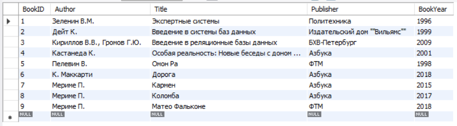

Запрос 0: Все авторы с повторениями

```sql
SELECT Book.Author FROM Book;
```

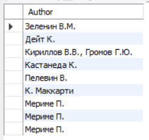

Пояснение: Данный запрос выводит всех авторов из таблицы Book, включая повторения. Как видно из результата, автор "Мериме П." встречается несколько раз, так как у него несколько книг в базе данных.

#### Задание 3: Удаление повторений с помощью DISTINCT
Запрос 1: Авторы без повторений

```sql
SELECT DISTINCT Book.Author FROM Book;
```

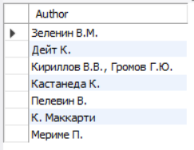

Пояснение: Оператор DISTINCT удаляет дублирующиеся записи из результата. Теперь каждый автор выводится только один раз, независимо от количества его книг в базе.

#### Задание 4: Сортировка результатов
Запрос 2: Авторы без повторений с сортировкой по алфавиту

```sql
SELECT DISTINCT Book.Author FROM Book ORDER BY Book.Author;
```

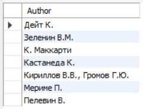

Запрос 3: Авторы и годы издания с сложной сортировкой

```sql
SELECT DISTINCT Book.Author, Book.BookYear 
FROM Book 
ORDER BY Book.Author ASC, Book.BookYear DESC;
```

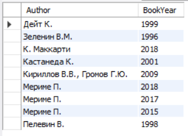

Запрос 4: Книги с сортировкой по году и названию

```sql
SELECT * FROM Book 
ORDER BY Book.BookYear ASC, Book.Title ASC;
```

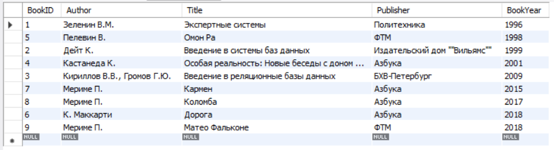

Пояснение: Оператор ORDER BY позволяет сортировать результаты запроса. Можно сортировать по нескольким полям с указанием направления (ASC - по возрастанию, DESC - по убыванию).

#### Задание 5: Ограничение вывода записей
Запрос 5: Две последние книги

```sql
SELECT * FROM Book 
ORDER BY Book.BookYear DESC 
LIMIT 2;
```

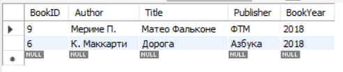

Пояснение: В Access используется оператор TOP, но в MySQL его аналогом является LIMIT. Данный запрос выводит только 2 первые книги.

#### Задание 6: Вывод половины списка
Запрос 6: Половина списка книг

```sql
SELECT * FROM Book 
ORDER BY Book.BookYear ASC 
LIMIT 5;
```

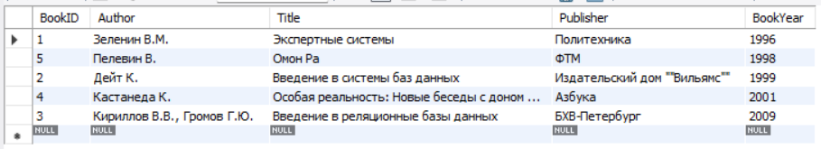

Пояснение: Для вывода первой половины записей в MySQL используется LIMIT с вычислением количества записей. В данном случае выводится 5 самых старых книг.

#### Задание 7: Запросы к связанным таблицам
Запрос 7: INNER JOIN связанных таблиц

```sql
SELECT BookInLib.LibID, Book.Author, Book.Title
FROM Book INNER JOIN BookInLib 
ON Book.BookID = BookInLib.BookID;
```


Запрос 8: LEFT JOIN связанных таблиц

```sql
SELECT BookInLib.LibID, Book.Author, Book.Title
FROM Book LEFT JOIN BookInLib 
ON Book.BookID = BookInLib.BookID;
```

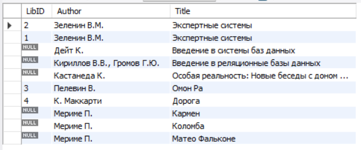

Пояснение:
- INNER JOIN возвращает только те записи, для которых есть соответствие в обеих таблицах
- LEFT JOIN возвращает все записи из левой таблицы (Book) и соответствующие записи из правой (BookInLib)

#### Задание 8: Условия в запросах WHERE
Запрос 9: Книги с 1997 по 2001 год

```sql
SELECT Book.Author, Book.Title, Book.Publisher, Book.BookYear
FROM Book
WHERE Book.BookYear BETWEEN 1997 AND 2001;
```


Запрос 10: Книги с условием IN

```sql
SELECT Book.Author, Book.Title, Book.Publisher, Book.BookYear
FROM Book
WHERE Book.BookYear BETWEEN 1997 AND 2001 
AND Book.Publisher IN ('Азбука', 'Политехника');
```

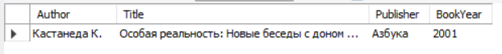

Запрос 11: Книги с условием OR

```sql
SELECT Book.Author, Book.Title, Book.Publisher, Book.BookYear
FROM Book
WHERE Book.BookYear BETWEEN 1997 AND 2001 
AND (Book.Publisher = 'Азбука' OR Book.Publisher = 'Политехника');
```

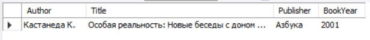

Запрос 12: Сложное условие с LIKE

```sql
SELECT Title, Author, Publisher, BookYear
FROM Book
WHERE (BookYear > 1999) 
AND (Author LIKE 'Г%' OR Publisher LIKE '%а')
ORDER BY Title DESC;
```

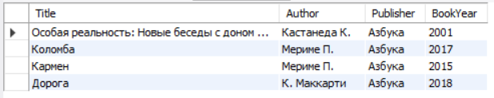

#### Анализ SQL-запроса

```sql
SELECT *
FROM Book
WHERE Author LIKE 'A%' OR BookYear > 2000 AND NOT Publisher LIKE '[ИП]%';
```

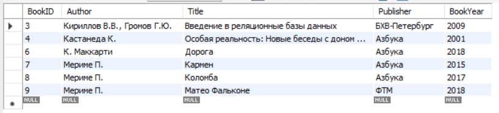

Пояснение: Оператор LIKE используется для поиска по шаблону:
- 'Г%' - начинается с буквы "Г"
- '%а' - заканчивается на букву "а"

Выводы
- В ходе лабораторной работы были изучены:
- Основные операторы языка SQL для выборки данных
- Способы удаления дубликатов с помощью DISTINCT
- Методы сортировки результатов запросов
- Работа с ограничением вывода записей
- Выполнение запросов к связанным таблицам с использованием JOIN
- Применение условий фильтрации в предложении WHERE

Все запросы были успешно выполнены и продемонстрировали различные возможности языка SQL для работы с реляционными базами данных.
